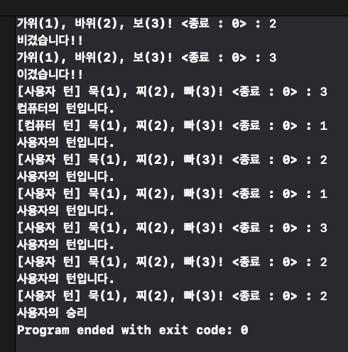
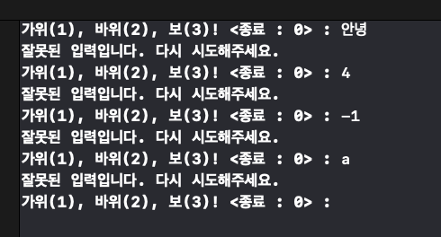

# 묵찌빠 게임 ✊✌️🤚🕹️
가위, 바위, 보 중 하나를 입력하여 컴퓨터와 승부하는 게임

> 프로젝트 기간: 2023.04.24 ~ 2023.04.28

## 🕺 팀원
|redmango|비모|
|:-:|:-:|
||
|[Github Profile](https://github.com/redmango1447)|[Github Profile](https://github.com/bubblecocoa)|

</br>

## 📝 목차
1. [타임라인](#-타임라인)
2. [게임규칙](#%EF%B8%8F-게임-규칙)
3. [실행화면](#%EF%B8%8F-실행-화면)
4. [다이어그램](#-다이어그램)
5. [트러블 슈팅](#-트러블-슈팅)
6. [참고 링크](#-참고-링크)
7. [팀회고](#-팀회고)

</br>

# 📆 타임라인 
- **2023-05-01: 가위바위보 게임 코드 작성**
사용자에게 입력받는 함수 추가
컴퓨터의 랜덤 정수와 사용자 입력 값으로 승부를 판별하는 함수 추가
상수 위치 변경, 변수 및 함수명과 전달인자 레이블 명 변경등 리팩토링

- **2023-05-02: 가위바위보 게임 코드 리팩토링**
가위바위보 enum 추가
startGame의 while문 재귀함수로 수정
startGame 함수내 로직을 별도의 함수로 분리
변수명 및 함수명 수정
에러처리 추가

- **2023-05-03: 묵찌빠 게임 코드 작성**
묵찌빠 enum 추가
불필요한 상수 및 변수 삭제
가위바위보와 묵찌빠 타입 추가
player 타입 추가
묵찌빠 승부 판별 함수 추가
승부에 따라 턴을 바꾸는 함수 추가

- **2023-05-04: 묵찌빠 게임 코드 리팩토링**
모든 타입에서 convertEnum 메소드 제거
RockPaperScissors를 구조체로 변경
묵찌빠의 compare메소드 내 중복 코드 제거

</br>

# 🧑‍⚖️ 게임 규칙

### 1️⃣ 가위바위보
<table>
    <thead>
        <tr>
            <th style="text-align:center" colspan="2">
                승리
            </th>
            <th style="text-align:center" colspan="2">
                패배
            </th>
            <th style="text-align:center" colspan="2">
                무승부
            </th>
        </tr>
        <tr>
            <th style="text-align:center">사용자</th>
            <th style="text-align:center">컴퓨터</th>
            <th style="text-align:center">사용자</th>
            <th style="text-align:center">컴퓨터</th>
            <th style="text-align:center">사용자</th>
            <th style="text-align:center">컴퓨터</th>
        </tr>
    </thead>
    <tbody>
        <tr>
            <td style="text-align:center">가위</td>
            <td style="text-align:center">보</td>
            <td style="text-align:center">가위</td>
            <td style="text-align:center">바위</td>
            <td style="text-align:center">가위</td>
            <td style="text-align:center">가위</td>
        </tr>
        <tr>
            <td style="text-align:center">바위</td>
            <td style="text-align:center">가위</td>
            <td style="text-align:center">바위</td>
            <td style="text-align:center">보</td>
            <td style="text-align:center">바위</td>
            <td style="text-align:center">바위</td>
        </tr>
        <tr>
            <td style="text-align:center">보</td>
            <td style="text-align:center">가위</td>
            <td style="text-align:center">보</td>
            <td style="text-align:center">가위</td>
            <td style="text-align:center">보</td>
            <td style="text-align:center">보</td>
        </tr>
    </tbody>
</table>

### 2️⃣ 묵찌빠
<table>
    <thead>
        <tr>
            <th style="text-align:center" rowspan="2">
                턴 획득
            </th>
            <th style="text-align:center" rowspan="2">
                턴 뺏김
            </th>
            <th style="text-align:center" colspan="2">
                게임 종료
            </th>
        </tr>
        <tr>
            <th style="text-align:center">승리</th>
            <th style="text-align:center">패배</th>
        </tr>
    </thead>
    <tbody>
        <tr>
            <td style="text-align:center">가위바위보 승리</td>
            <td style="text-align:center">
                가위바위보 패배<br>
                잘못된 입력
            </td>
            <td style="text-align:center">
                턴 획득 상태에서<br>
                가위바위보 무승부
            </td>
            <td style="text-align:center">
                턴 뺏김 상태에서<br>
                가위바위보 무승부
            </td>
        </tr>
    </tbody>
</table>

</br>

# 🖥️ 실행 화면


- 정상적인 게임 진행시


- 가위바위보에서 잘못된 입력을 한 경우


- 묵찌빠에서 잘못된 입력을 한 경우


- 묵찌빠 승패 이외의 게임 종료 방법 - `0` 입력

</br>

# 💎 다이어그램
<details>
<summary>순서도 - 클릭하여 더보기</summary>
<div markdown="1">


</div>
</details>

</br>

# 🚀 트러블 슈팅
## 1️⃣ 프로젝트 요구사항에 맞지 않는 코드의 등장

### 🔍 문제점
```swift
func startGame() {
    while 조건 {
        guard let ~~ else {
            continue
        }
    }
}
```
프로젝트 진행 중 위와 같은 형태의 코드가 작성되었다.
작업 도중 요구사항을 다시 확인해보니 다음과 같은 요구사항이 있었다.
> 코드 들여쓰기는 2번 초과하지 않습니다.

`while`문 내의 로직을 별도 함수로 분리하려 했으나, `continue`절을 `return`할 수 없었다.
  
### ⚒️ 해결방안
`while`문 대신 `재귀함수`를 사용하여 문제를 해결했다.
재귀함수로 인해 스택 오버플로우가 발생할수도 있지만, 확인 결과 해당 문제는 발생하지 않을것으로 판단되어 코드에 적용했다.
판단의 사유는 다음과 같다.
- 함수 내의 프로퍼티를 참조하여 재귀 호출하지 않음
- 호출하는 함수에 return값이 없음
```swift
func startGame() {
    guard let ~~ else {
        startGame()
    }
}
```
수정 후 코드는 위와 같은 형태가 되었으며, 코드 들여쓰기도 줄어들고 `continue`를 가지고 다닐 필요가 없어 로직 분리의 제약이 사라졌다.

## 2️⃣ Enum활용에 대한 고민

### 🔍 문제점
```swift
func isUserWin(_ user: Int, _ computer: Int) -> Bool {
    return user == 1 && computer == 3
        || user == 2 && computer == 1
        || user == 3 && computer == 2
}
```
위와 같은 기존 코드에 대해 아래의 피드백을 받았다.
> 1, 2, 3은 무엇을 의미하는지 파악하기 어렵네요. 
> 매직넘버와 enum 키워드를 사용해서 코드를 개선시켜 볼까요?

### ⚒️ 해결방안
```swift
enum RockPaperScissors: Int {
    case scissors = 1
    case rock = 2
    case paper = 3
}

func convertEnum(of number: Int) throws -> RockPaperScissors {
    switch number {
    case 1:
        return .scissors
    case 2:
        return .rock
    case 3:
        return .paper
    default:
        throw ConsoleError.inputError
    }
}

func isUserWin(_ user: RockPaperScissors, _ computer: RockPaperScissors) -> Bool {
    return user == .scissors && computer == .paper
    || user == .rock && computer == .scissors
    || user == .paper && computer == .rock
}
```
위와 같이 생성&입력받은 `Int`값을 `eunm`으로 매칭하여 리턴하고 사용 할 수 있게 코드를 수정하였다.
결과적으로 요구조건을 참조해야했던 1, 2, 3의 숫자보다는 scissors, rock, paper으로 변경함으로써 훨씬 알아보기 쉬운 코드가 되었다.

## 3️⃣ 가위바위보와 묵찌빠는 다른 게임

### 🔍 문제점
가위바위보와 묵찌빠는 동일한 요소를 가지지만, 숫자 입력이 의미하는 요소는 다르다.
코드를 비슷하지만 다르게 처리해야하는 것이다
||가위바위보|묵찌빠|
|:-:|:-:|:-:|
|1|가위|묵|
|2|바위|찌|
|3|보|빠|

3은 ✋로 동일하지만, 1과 2의 요소가 서로 바뀌어있다.
그렇기 때문에 기존 `RockPaperScissors enum`을 사용할수도, 승패 판별 함수도 사용할 수 없었다.
또한 두 종류의 게임이 요구하는 함수명이 겹치는 경우가 있어 몇몇 함수명은 직관성이 떨어지게 되었다.
결과적으로 새로운 `enum`을 추가하고, 조건식을 추가하고, 함수를 추가하니 읽기 힘든 코드가 되었다.

### ⚒️ 해결방안
동일한 코드가 반복하는듯 보여도 처리 로직은 달라야 했기에 `RockPaperScissorsManager` 클래스와 `MukJiPpa` 클래스로 분리했다.
각각의 클래스로 분리하니 함수명을 정리하기 쉬웠고, 케이스마다의 조건문이 사라졌기 때문에 각 클래스에서 요구하는 기능만 명확하게 작성할 수 있었다.

</br>

# 📚 참고 링크

* [티스토리 - 꼬리재귀](https://joooing.tistory.com/entry/%EC%9E%AC%EA%B7%80-%E2%86%92-%EA%BC%AC%EB%A6%AC-%EC%9E%AC%EA%B7%80-Tail-Recursion)
* [🍎Apple Docs - Enumerations](https://docs.swift.org/swift-book/documentation/the-swift-programming-language/enumerations/)

</br>

# 🙆🏻 팀회고

### 우리 팀이 잘한 점
코드가 잘못되어가고 있음을 빠르게 인정하고 더 좋은 코드를 위해 자신의 코드가 지워지는 상황에도 긍정적인 마인드를 잃지 않았다.

### 서로에게 좋았던 점 피드백
비모가 redmango에게: 생각하지 못한 부분에서의 문제 돌파 능력이 있었습니다. (e.g. 네이밍 센스, 에러처리 생성)
네비게이터로써 설명할 때 알아듣기 쉽게 이야기 해줍니다.

redmango가 비모에게: 생각하지 못한 부분에서의 문제 돌파 능력이 있었습니다. (e.g. 타입 생성, 메서드 내 로직)
빠르고 깔끔한 문서 작성

### 서로에게 아쉬웠던 점 피드백
비모가 redmango에게: 망고는 아침형 인간이 아니었습니다.

redmango가 비모에게: 체력이 뛰어 납니다. 한번씩 쉬자고 이야기하지 않았으면 논스톱 짝프로그래밍을 하게 되었을 것 같습니다.
